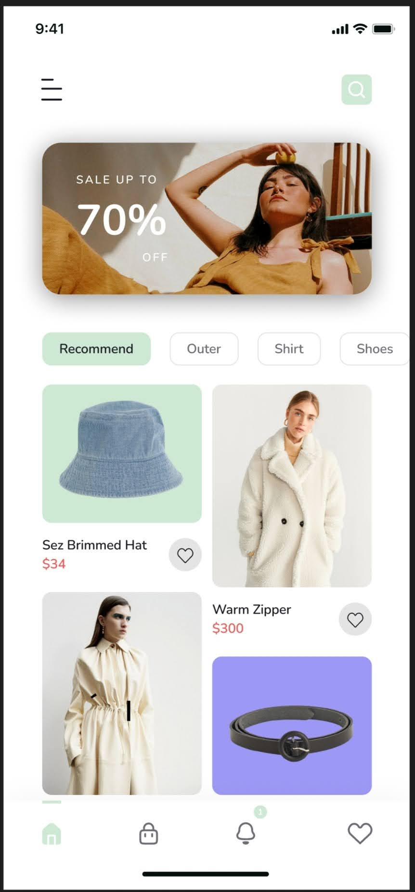
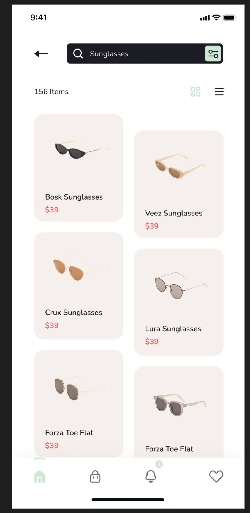
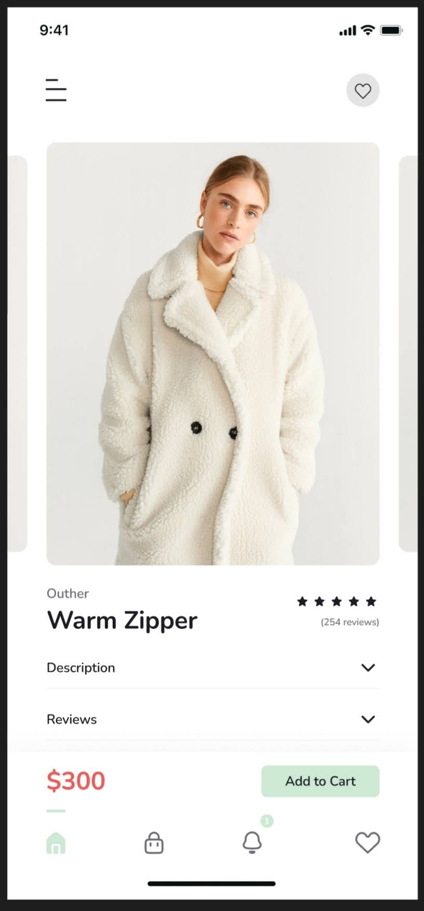

## Chic Cart
<div style="display: flex;">
    &nbsp;&nbsp;&nbsp;&nbsp;
    &nbsp;&nbsp;&nbsp;&nbsp;
    
</div>

#### The django_rest_framework project I made for the mobile commerce application.

## Description

The project is under development.

## Installation
````bash
git clone https://github.com/elizamin-orucov/chic_cart_project .
pip install -r requirements.txt
django-admin startproject core .
py manage.py migrate
py manage.py createsuperuser
py manage.py runserver
````